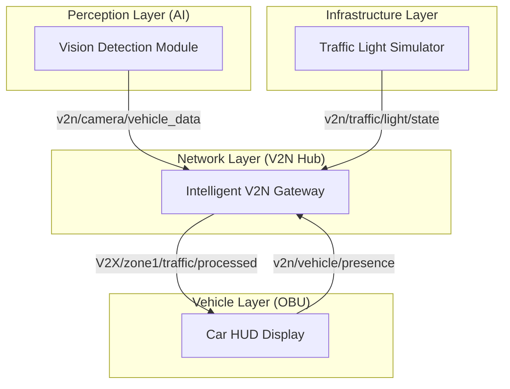
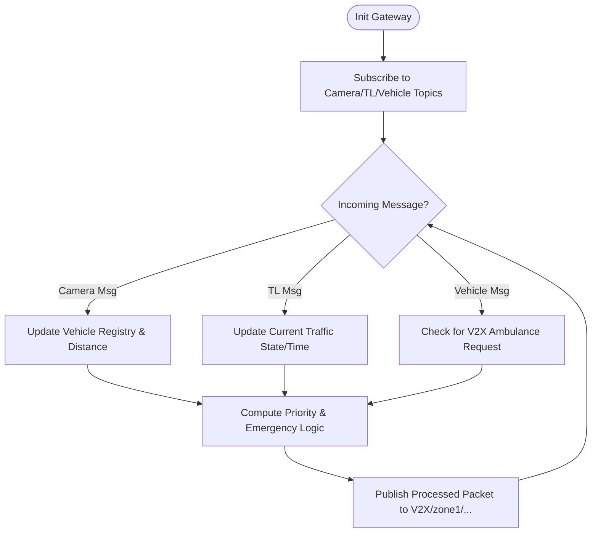
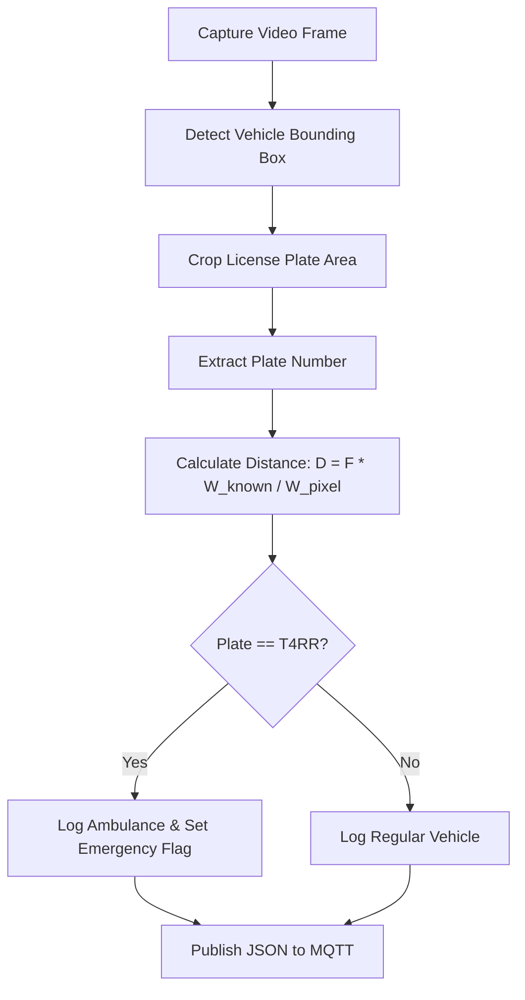
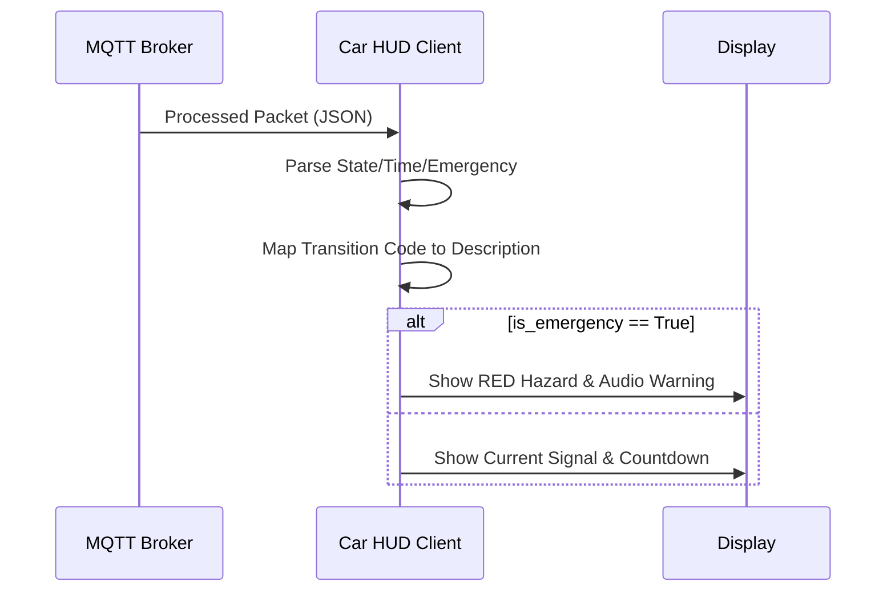
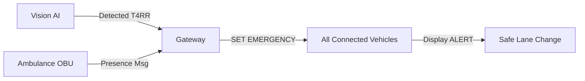

# V2N Smart Traffic Management System - Technical Documentation

## 1. Executive Summary: The V2N Paradigm
The **Vehicle-to-Network (V2N)** system is a cornerstone of modern Intelligent Transportation Systems (ITS). Unlike traditional V2V (Vehicle-to-Vehicle), V2N leverages a central "Network" entity (the Cloud Gateway) to aggregate data from multiple sources—infrastructure, cameras, and vehicles—to make global optimization decisions. This system specifically focuses on **Emergency Vehicle Preemption (EVP)** and real-time traffic state broadcasting.

---

## 2. System Architecture

The ecosystem consists of four distributed nodes communicating asynchronously over a secure MQTT cloud backbone.



---

## 3. Component Deep Dive

### 3.1. Intelligent V2N Gateway (`Intelligent_Gateway(v4).py`)
The Gateway is the brain of the "Network." it acts as the central coordinator and data aggregator.

**Key Responsibilities:**
*   **Data Fusion**: Merging Vision data (Camera) with Infrastructure data (Traffic Light).
*   **Vehicle Registry**: Maintains a real-time list of vehicles and their distances.
*   **Emergency Arbiter**: Decides if a global emergency state is active based on multiple inputs.

**Process Flowchart:**


---

### 3.2. Vision Hub & AI Distance Estimation (`distance_after_edit_.py`)
This module provides "sight" to the network. It processes a video stream/feed to extract metadata from the physical world.

**Technical Stack:**
*   **YOLOv8**: Object detection for vehicle classification.
*   **EasyOCR**: Text recognition for license plate extraction.
*   **Focal Length Equation**: Used for monocular distance estimation.

**Operation Flow:**


---

### 3.3. Smart Traffic Light Infrastructure (`Traffic_light_GUI.py`)
This component simulates a connected intersection. It doesn't just change lights; it broadcasts its **intentions**.

**V2N Features:**
*   **State Transparency**: Broadcasts the current state and the *next* state.
*   **Transition Codes**: Enables vehicles to programmatically respond to changes (e.g., "Prepare to Brake").

**States & Durations:**
| State | Duration | V2X Transition Code |
| :--- | :--- | :--- |
| RED | 12s | 1 (to Yellow) |
| YELLOW | 3s | 2 (to Green) |
| GREEN | 15s | 3 (to Yellow) |

---

### 3.4. Car HUD Display (`Car_client.py`)
The OBU (On-Board Unit) emulator. It receives the network's processed "truth" and renders it for the driver.

**Functional Logic:**


---

## 4. Operation Scenarios

### 4.1. Scenario A: Normal Flow
In the absence of emergency vehicles, the system optimizes for information awareness, letting cars know how much time is left before a signal change.


### 4.2. Scenario B: Emergency Preemption (The T4RR/REX Logic)
When an ambulance is detected by AI or OBU, the Gateway triggers a global override.




---

## 5. MQTT Data Protocol

### 5.1. Input Topics
*   `v2n/camera/vehicle_data`: Contains `{plate_id, distance_m, is_ambulance}`.
*   `v2n/traffic/light/state`: Contains `{state, next_state, remaining_time}`.

### 5.2. Output Topic (The V2N Feed)
Topic: `V2X/zone1/traffic/processed`
```json
{
  "state": "RED",
  "next_state": "GREEN",
  "remaining_time": 8,
  "is_emergency": true,
  "warning": "🚨 AMBULANCE APPROACHING [T4RR]! NORMAL CARS MUST STOP! 🚨",
  "density": 4,
  "closest_vehicle": {
    "plate_id": "T4RR",
    "distance_m": 15.4
  }
}
```

---

## 6. Development & Deployment
The system is built on Python 3.10+ using:
*   `paho-mqtt` for cloud communication.
*   `OpenCV` & `YOLOv8` for vision.
*   `Tkinter` for simulation GUI.

**Conclusion**: This V2N implementation provides a robust framework for prioritizing life-saving vehicles while maintaining high throughput for standard urban traffic.
