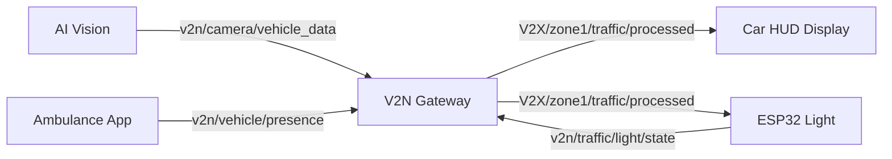
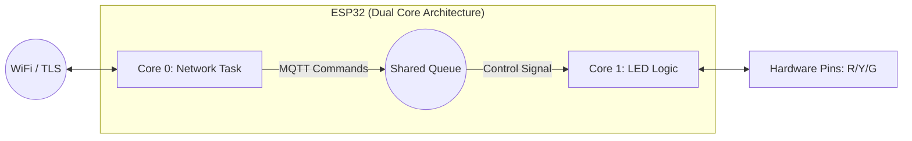
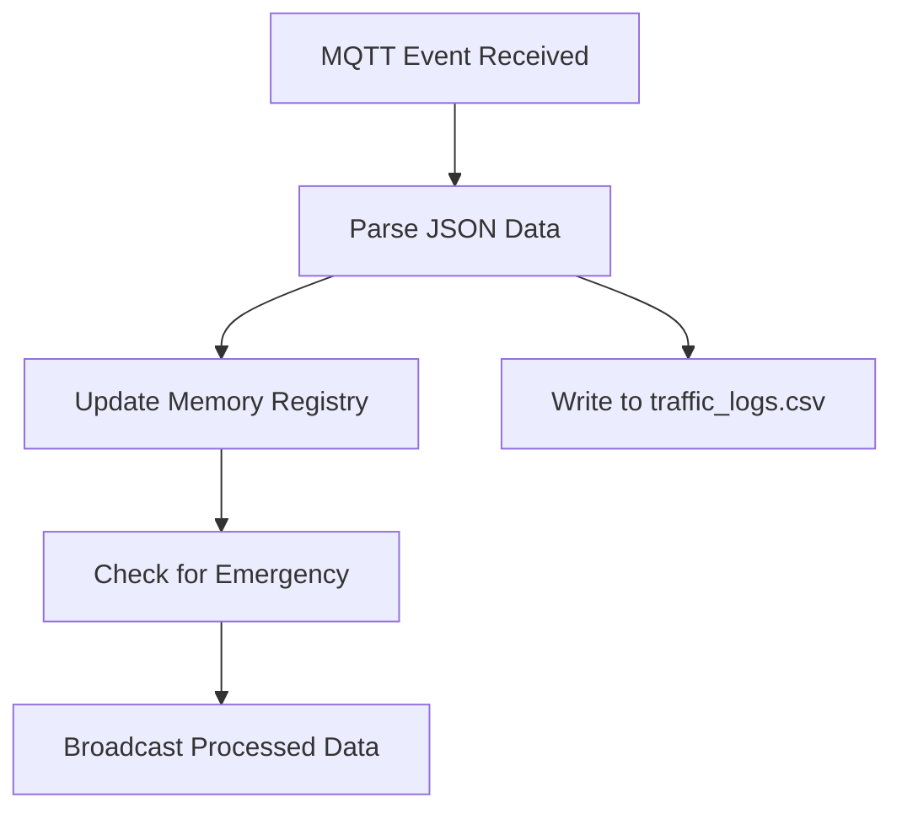

# V2N Smart Traffic System: Technical Documentation
**A Professional Engineering Overview of High-Speed V2N Vehicle Management**

---

## 1. Executive Summary
The **V2N (Vehicle-to-Network)** system is a sophisticated IoT ecosystem designed to optimize urban traffic flow through real-time data synchronization. By leveraging Computer Vision (AI) and low-latency network protocols (MQTT), the system enables active interaction between the traffic infrastructure and vehicles, prioritizing emergency response services autonomously.

### Core System Components:
1. **Intelligent V2N Gateway:** The central backend service (Logic Engine) managing all data orchestration.
2. **AI Vision Module:** Edge-processing unit for license plate recognition (LPR) and distance estimation.
3. **ESP32 Smart Traffic Controller:** The physical hardware interface controlling the traffic signal states.
4. **Car HUD (OBU Simulator):** A vehicle-side Human-Machine Interface (HMI) for real-time driver notifications.

---

## 2. MQTT Communication Protocol
The system utilizes the MQTT protocol (via HiveMQ Cloud) for high-performance, asynchronous messaging.

| Primary Topic | Data Source | Payload Example | Functional Role |
| :--- | :--- | :--- | :--- |
| `v2n/camera/vehicle_data` | AI Vision | `{"plate_id": "T4RR", "distance_m": 12.5, "is_ambulance": true}` | Real-time vehicle telemetry report. |
| `v2n/traffic/light/state` | ESP32 Controller | `{"state": "RED", "remaining_time": 10}` | Traffic light telemetry and synchronization. |
| `V2X/zone1/traffic/processed` | V2N Gateway | `{"command": "emergency", "density": 3}` | Centralized command and processed data broadcast. |
| `v2n/vehicle/presence` | Vehicle OBU | `{"vehicle_type": "AMBULANCE"}` | Direct V2X priority requests from emergency vehicles. |

---

## 3. Operational Logic & Scenarios

### Scenario A: Normal Traffic Monitoring
1. **Vision Ingestion:** The AI module calculates distance using focal-length mathematics and publishes data frame-by-frame (every 10 frames).
2. **Registry Management:** The Gateway updates the `vehicle_registry` in memory.
3. **HMI Update:** Nearby vehicles receive their exact distance-to-light and current state updates directly on their HUD.

### Scenario B: Emergency Vehicle Priority (EVP)
1. **Identification:** The system identifies specific plate IDs (e.g., `REX`, `T4RR`) or an `is_ambulance` flag.
2. **Priority Trigger:** The Gateway sets `is_emergency = True` and broadcasts an `emergency` command.
3. **Hardware Override (ESP32):**
   - If **RED**: Transitions to **YELLOW (3s)** then **GREEN**.
   - If **GREEN**: Maintains stability until the vehicle cleared signal is received.
4. **Self-Healing (Registry Cleanup):** If no data is received for **5 seconds (TTL)**, the Gateway assumes the vehicle has passed and restores normal operations.

---

## 4. Hardware Architecture & Fault Tolerance

### ESP32 Dual-Core Strategy
To prevent network latency from blocking safety-critical LED logic, the firmware implements FreeRTOS task pinning:

### Fail-Safe Mechanism
If the Gateway or Cloud connection is lost for more than **15 seconds**, the ESP32 enters **Local Fail-safe Mode**, executing a fixed timing cycle locally to ensure traffic continuity.

---

## 5. Data Persistence & Analytics
The Gateway autonomously logs all system events into a persistent storage format:
* **Storage Path:** `traffic_logs.csv`
* **Workflow:** Receipts → JSON Parsing → Registry Update → **CSV Logging**.

---

## 6. Human-Machine Interface (Visual Assets)

### Professional Car HUD (OBU Interface)
The primary driver visualization tool, optimized for dark-mode low-distraction environments.

---

## 7. Technical FAQ for Academic Review

* **Q: Why was MQTT chosen over REST/HTTP?**
  A: MQTT's publish-subscribe model offers significantly lower overhead and faster propagation times, critical for V2N real-time applications.
* **Q: How does the system handle multiple vehicles?**
  A: The Gateway manages a threaded `vehicle_registry` with sub-second concurrency handling to track and prioritize multiple detections simultaneously.
* **Q: Is the system scalable?**
  A: Yes, the cloud-based MQTT broker allows adding multiple intersections (Zones) without reconfiguring the core logic.
